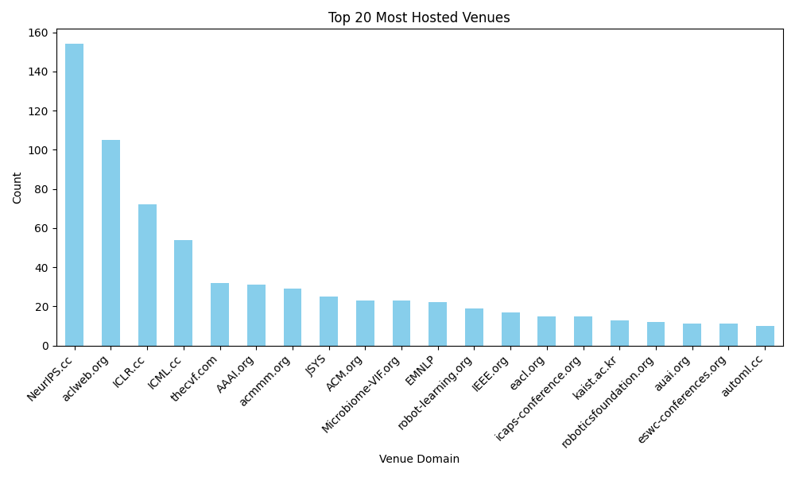

# OpenReview Tracker
Explore OpenReview for all the venues hosted on the site.

Run ```pip install openreview-py``` to install openreview api for python

Some functinalities in util:
| Function | Description |
| --- | --- |
| getAllVenues | Get all the venue names from the OpenReview API |
| mostHostedVenue | Get top 20 most hosted venue domain such as NeurIPS.cc |
| getAbstractWithRating | Get the venue's submission and pair each abstract with the mean rating from every reviewer |
| topSubmission | Get the top 20 submissions from that certain conference |
| toLLMTrainingData | Convert the venue data to a JSON file with following format: {'text': "### Human: Rate this abstract ...}### Assistant: I would rate this (mean_dating)!"} |

### TODO
- [ ] Use the toLLMTrainingData and train a custom Llama to rate an abstract

Example most hosted venue plot:

